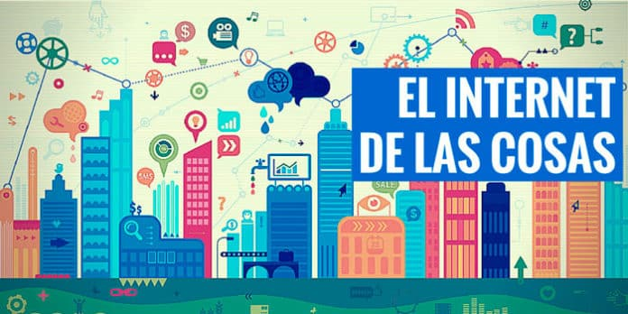

# Ejercicio6Markdown
# Titulo: IoT, el Internet de las Cosas, viene para quedarse
# Párrafo de introducción con palabras en negrita y cursiva
¿En qué consiste el IoT?

Esto en cursiva, **Debido a este desarrollo en las tecnologías, surge el concepto del Internet de las Cosas, también conocido por IoT (acrónimo de «Internet of Things» en inglés), que no es más que la interconexión digital de objetos de la vida cotidiana mediante internet (en vez de hacerse entre personas).** Este concepto *fue mencionado por primera vez por el co-fundador y director ejecutivo del Auto-ID Center de MIT, Kevin Ashton, que lo que pretendía era describir un sistema donde internet estuviera conectado al mundo físico a través de sensores instalados* en nuestros aparatos.

## Subtítulos
# Una tabla
IOT1|IOT2|IOT3
---|---|---
Juan|4.3|13/09/1994
luis|3.5|25/12/1995

# Índice (Empresas punteras en IoT)
*Sigfox 
-LoraWAN

# Porción de código Python

 def self.search_and_persist(query='')
    last_tweet = self.last_tweet(query)
    results = Twitter.search(query, rpp:100, since_id: last_tweet.try(:id_str)).results
    self.create_from_search_results(results, query)
 end

# Cita
>Por domótica, entendemos todas aquellas técnicas orientadas a la automatización inteligente de una vivienda, que integran la tecnología en los sistemas de seguridad, gestión energética, bienestar o comunicaciones.

# Una imagen

